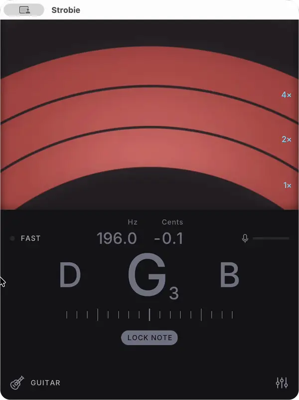
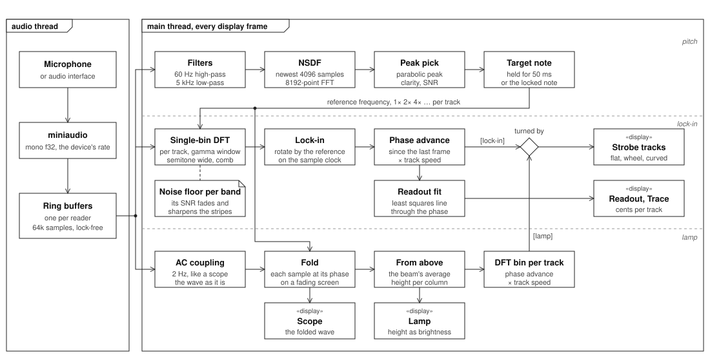

<div align="center">
  
# Strobie

A simple stroboscopic instrument tuner.



</div>


Strobie is on the App Store for Mac and iPhone. The source is here to read and build yourself, see [Development](#development).

### Features

- Automatic pitch detection based on NSDF (McLeod Pitch Method).
- Smooth and responsive strobe display, the stripe sharpness adapts to the signal quality.
- Note lock: keeps the strobe on the note, another note played pins the gauge at the end on its side.
- Harmonic mode: shows the partials of the detected note on up to 5 strobe tracks.
- Track settings: tap a track to choose its partial (1× to 8×, or the fifth at 1½×), move its target by up to ±50 cents (e.g. for a stretched octave) and change its speed.
- Vernier mode: a geared mode that shows the same fundamental frequency in each band, but with increasing sensitivity.
- Fast toggle: the strobe spins 4× faster per cent of detuning, for the final adjustment.
- Four displays, see [Displays](#displays):
  - Strobe: curved tracks, a wheel or flat tracks, turned by a lock-in on each partial or by the lamp.
  - Lamp: the mechanical strobe, stripes lit by the wave.
  - Scope: the waveform synced to the strobe's frequency, tap it for a Lissajous figure.
  - Trace: the cents over time.
- Note offsets: tune a note up to ±25 cents off pitch, the strobe stands still at the offset note.
- Transpose for B♭, E♭, F and other transposing instruments.
- Guitar, bass and ukulele tunings with an optional capo, the ruler shows only their strings.
- Concert A from 400 to 480 Hz.
- Hertz/Cents display.
- Four colorways (red, mint, amber, mono) and an optional retro lamp glow.


### License

Copyright ©️ 2025–2026 Davorin Šego <br />
Licensed under the GPL v3  <br />
https://www.gnu.org/licenses/gpl-3.0.en.html


### Third-Party Resources


- [PortAudio](https://portaudio.com/) ring buffer <br />
Portable Real-Time Audio Library <br />
Copyright (c) 1999-2011 Ross Bencina, Phil Burk <br />

- [PFFFT: a pretty fast FFT.](https://bitbucket.org/jpommier/pffft) <br />
Copyright (c) 2013  Julien Pommier (pommier@modartt.com) <br />
FFTPACK license <br />

- [The Inter typeface family](https://rsms.me/inter/) <br />
Copyright (c) 2016 The Inter Project Authors <br />
SIL Open Font License 1.1 <br />

- [Noto Sans](https://github.com/notofonts) <br />
Copyright 2022 The Noto Project Authors (https://github.com/notofonts/latin-greek-cyrillic) <br />
SIL Open Font License, Version 1.1 . <br />

- [SDL](https://libsdl.org/) <br />
Copyright (C) 1997-2025 Sam Lantinga <br />
Zlib license <br />

- [miniaudio](https://miniaud.io/) <br />
Copyright 2025 David Reid <br />
Public domain (Unlicense) or MIT No Attribution <br />

- [stb](https://github.com/nothings/stb) <br />
Copyright (c) 2017 Sean Barrett <br />
Public domain or MIT license <br />

- [Phosphor Icons](https://phosphoricons.com/) <br />
Copyright (c) 2023 Phosphor Icons <br />
MIT license <br />


### Development

You need [Odin](https://odin-lang.org/docs/install/), the [just](https://github.com/casey/just) command runner, git, clang (on macOS from the Xcode command line tools) and SDL3 (`brew install sdl3`). It draws with SDL3 GPU, Metal on macOS and iOS, Vulkan on Linux and Android.

```sh
git clone https://github.com/dsego/strobe-tuner
cd strobe-tuner
just dev
```

The first run clones and compiles the dependencies into `external/`, later runs skip that.

| Command | What it does |
| --- | --- |
| `just dev` | Debug build, then runs it |
| `just dev stats` | Also shows the signal stats and NSDF plots |
| `just dev ios` | Builds for the iOS simulator and runs it there, needs Xcode |
| `just ipa` | Signed build for iPhone, see `platform/ios/build-device.sh`, needs Xcode and a provisioning profile |
| `just apk` | Debug signed build for Android, see [Android](#android) |
| `just build` | Optimized build for this machine |
| `just pkg` | Signed build for the Mac App Store, see `platform/macos/build-pkg.sh`, links SDL in statically |
| `just test` | Unit tests of the pitch detection and strobe code |

Debug builds also have <kbd>Cmd</kbd><kbd>,</kbd> to open the config file and <kbd>Cmd</kbd><kbd>Shift</kbd><kbd>,</kbd> to reload it.

#### Linux

Not tried yet. It draws with Vulkan, `just dev` compiles the shaders with `glslc`, and needs SDL3 and a Vulkan driver. The audio libraries (PulseAudio, PipeWire through its PulseAudio server, or ALSA) are loaded at runtime. The first `just dev` also compiles Odin's vendored stb and miniaudio into the Odin folder, which has to be writable, the Linux install leaves them uncompiled.

```sh
sudo apt install clang git libsdl3-dev glslc  # Debian, Ubuntu
sudo dnf install clang git SDL3-devel glslc   # Fedora
just dev
```

The config is saved to `$XDG_CONFIG_HOME/Strobie/config.ini`, or `~/.config/Strobie/config.ini`.

#### Android

`just apk` builds a debug signed `build/android/Strobie.apk`, see `platform/android/build.sh`. No Android Studio or Gradle, only the command line SDK, adb and a JDK for SDL's Java classes and the build tools. The first build compiles SDL into `external/android`, and stb into the Odin folder with the NDK, where Odin's bindings look for it.

```sh
brew install --cask android-platform-tools android-commandlinetools
brew install openjdk@17
```

Homebrew's JDK is keg-only, the system `java` doesn't find it and `sdkmanager` fails with "Unable to locate a Java Runtime". Point the shell at it in `~/.zshrc`:

```sh
export JAVA_HOME="$(brew --prefix openjdk@17)/libexec/openjdk.jdk/Contents/Home"
export PATH="$JAVA_HOME/bin:$PATH"
```

Then the SDK packages, `sdkmanager --list | grep ndk` shows the NDK versions:

```sh
sdkmanager "platform-tools" "platforms;android-35" "build-tools;35.0.0" "ndk;28.2.13676358"
```

To install on a phone, tap Build number in Settings → About phone 7 times, turn on USB debugging in Developer options, plug it in and accept the prompt from `adb devices`. `ANDROID_DEVICE=usb just apk` then installs and launches it. `adb logcat -s SDL` shows SDL's logs, `brew install scrcpy` mirrors the screen.


### How it works



#### Displays

All four show the same thing, how the note's phase slips against a reference at the target pitch, in four ways:

- **Strobe**: the tracks of a strobe tuner, one per partial in harmonic mode, standing still when the partial is in tune and turning left when flat, right when sharp. The shape is flat, a wheel or curved tracks. They can be turned by:
  - **Lock-in** (the default): each track measures its own partial with a single-bin DFT, see [Stroboscopic effect](#stroboscopic-effect). Smooth, with each partial measured on its own.
  - **Lamp**: each track turns by its partial on the lamp's screen, a DFT bin of it. That's the strobe the other way round, from the picture to the tracks, with its quirks: a pluck or a weak partial can make the stripes jump.
- **Lamp**: the disc of a mechanical strobe lit by a lamp that flashes with the wave. Every sample is folded onto two periods of the reference, the stripes are as bright as the wave is high there. A detuned note drifts, a fast drift smears the stripes to gray, like the eye does with a real one.
- **Scope**: the same folded screen as it is, an oscilloscope with its sweep synced to the reference. Tapped, it draws the wave against the reference's cosine instead, a Lissajous figure that stands still in tune and rolls open and shut when it isn't.
- **Trace**: the cents of the readout over the last few seconds, to see a vibrato or a drift.

The cents readout and the trace come from the lock-in in every display.

#### Pitch detection

The pitch detection algorithm uses autocorrelation via FFT, following the method described in _"A Smarter Way to Find Pitch" (Philip McLeod, Geoff Wyvill)_. It analyzes the newest 4096 samples every display frame to accurately identify the fundamental frequency, even in the presence of strong harmonics. Only this path is filtered: a 60 Hz high-pass takes out DC and low frequency rumble, which would lift the NSDF between periods, and a 5 kHz low-pass takes out hiss above the highest note, which blurs the period. A built-in clarity measure provides a confidence score for each detected pitch. Clarity and SNR (signal-to-noise ratio) help determine whether the pitch is strong or weak.

A newly detected note has to hold for 50 ms before the strobe switches to it, as a strong detection or a run of detections steady to a few cents, so a single noisy detection of a decaying note doesn't reset the display.

#### Stroboscopic effect

The strobe effect is driven by a lock-in amplifier (heterodyne) phase comparator built on a single-bin DFT tuned to the target note's reference frequency (e.g., 110 Hz). The idea is to extract the phase of the signal at a specific frequency, relative to a reference oscillator, and map that to a visually intuitive strobe motion.

Core steps:
- Input: The strobe takes the input as it is, unfiltered. Each band's narrow DFT rejects everything away from its frequency.
- Frequency targeting: Compute a windowed single-bin DFT over the newest samples, precisely tuned to the reference frequency.
- Demodulation: Rotate the DFT result by the phase of a reference oscillator running on an absolute sample clock. When the input pitch matches the reference, this phase stands still; a detuned signal makes it rotate at the frequency difference.
- Strobe motion: The stripes turn by the measured phase, times the track's speed.
- Readout: The cents of each track are the slope of a least squares line through its phase, older measurements weighted down, restarted after each pluck's attack.
- Stripe sharpness: The stripe edges are as sharp as the band's SNR allows, and the stripes fade out as it drops into the background noise.

Every track's window is sized for a band a semitone wide around the fundamental, about 0.16 s at 110 Hz. The window is gamma shaped, weighted toward the newest samples like an analog lock-in's low-pass, so the phase is measured as of about 50 ms ago instead of half the window. A semitone lets the neighbouring partials in, so the window is also smoothed with a box one period of the note long (two for a fifth), a comb whose nulls fall on every other partial.

The strobe phase is rescaled so each note spins at the same rate per cent of detuning, and since it's a measured phase it can be multiplied by any factor, which is what the track speed, the fast toggle and the vernier mode are built on.


#### Ways to build a strobe

The ways to turn the samples into a strobe display, what goes wrong with each, and which ones are in the app.

1. **Cutting frames** (tried and dropped): each display frame takes the newest samples and lines one reference period up with the pattern, drawn as stripes, either resampled so one period fills the pattern or with a fractional counter that keeps the frames aligned to the reference and rounds each one to whole samples. The trouble:
   - No smear: every frame is a sharp snapshot. On a real strobe the eye blends the moving pattern, so a fast drift washes out to gray, here it jumps from frame to frame.
   - Resampling or rounding: high notes have few samples per period, 12 at 4 kHz, so the resampled pattern moves in blocks, and rounding moves it by up to half a sample per frame, 15° of jitter.
   - Bleed: each band needs an IIR bandpass, otherwise the other partials bleed into its pattern. A narrow IIR shifts the phase steeply around its centre frequency, differently in each band, so the tracks are offset from each other and react at different speeds when the pitch moves, e.g. a pluck gliding down from sharp.
2. **Folding** (the Lamp and the Scope): instead of cutting frames, every sample is placed on the screen at its phase of the reference, on the absolute sample clock, and the screen fades like phosphor. Each column averages the wave at that phase over the persistence time. Nothing is rounded or resampled, and the smear comes by itself: a slow drift stays sharp, a fast one washes out. Folding at the reference period is itself a comb, only its harmonics add up. The picture itself drifts by the actual phase the note slips, as fast as it slips, but a DFT bin of the screen per partial gives that phase as a number, and that can be scaled: that's how the lamp turns the strobe tracks. It's measured on a picture made for the eye though: the screen's persistence and a pluck or a weak partial show up in it, and the stripes can jump.
   - Through a square-wave slot: [strobeTuner](https://sourceforge.net/projects/strobetuner/) (Scott Duplichan, GPLv3) builds each band the other way round from the lamp. Every frame, each column multiplies the last 6 periods by a ±1 square wave at the band's pitch, shifted by the column's place on the wheel, and clips the average. That's the same fold, seen through a slot half a period wide instead of a thin slit, and recomputed from the raw audio for every column. A real disc's stripes are half black and half clear, so the square slot is the more literal model of one.
3. **Phase lock** (the default): the lock-in compares the phase of each partial with the reference and the strobe turns by that phase, see [Stroboscopic effect](#stroboscopic-effect). It measures the phase on the samples themselves rather than on a screen: the single-bin DFT is a bandpass whose phase shifts alike in every band, and the phase is continuous, so the stripes move smoothly at any pitch.
4. **Simulated from a pitch detector**: a pitch detector like NSDF or YIN compares the signal with itself, so it gives the period but not where the wave is. Stripes turned by the detected cents follow the integral of an estimate: its noise walks them off while the note holds in tune, a jump in phase doesn't show, and harmonic tracks can only be multiples of one f0, so a partial out of tune with its fundamental never shows. Here the pitch detector only picks the note. The stripes are the signal's phase against a reference on the sample clock, measured again every frame, so the error doesn't add up. The cents go the other way round, the readout is the slope of the measured phase rather than the phase the integral of the cents.


#### Noise floor

Each strobe band keeps an estimate of the background noise at its frequency (i.e. the noise floor), which gives the SNR used by the display and the readout. The pitch detector keeps one the same way for the level of the whole signal, its SNR is part of telling a strong pitch from a weak one. It follows the level in dB while nothing louder is playing and pauses when the SNR is above a threshold, only creeping up slowly so it can catch up with a noisier environment. It's relearned when switching the input device and when the input is opened again, e.g. after the app was in the background.
